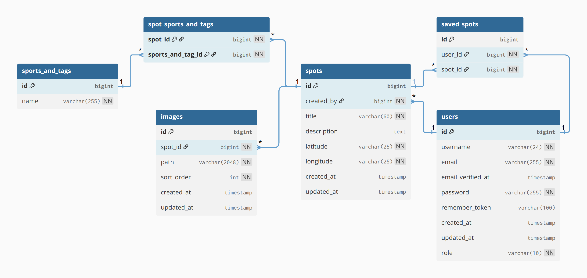

# FlowFinder fejlesztői dokumentáció

Ez a dokumentáció a **FlowFinder** webalkalmazás fejlesztői áttekintő dokumentuma. A célja, hogy a projekt technikai felépítése, fő moduljai, fejlesztői belépési pontjai és kapcsolódó dokumentációi egy helyen elérhetők legyenek.

A FlowFinder egy sportos közösségi spotkereső alkalmazás, amelyben a felhasználók spotokat böngészhetnek, részletes adatlapokat nézhetnek meg, spotokat menthetnek, saját spotokat tölthetnek fel, képeket kezelhetnek, címkékkel kereshetnek, valamint saját profiljukon keresztül kezelhetik a tartalmaikat.

Ez a fájl az általános fejlesztői dokumentáció. A backend, frontend és tesztelési részek külön fájlokban szerepelnek, hogy a dokumentáció átláthatóbb és könnyebben karbantartható legyen.

## Tartalomjegyzék

- [Kapcsolódó dokumentációk](#kapcsolódó-dokumentációk)
- [Projekt rövid technikai áttekintése](#projekt-rövid-technikai-áttekintése)
- [Teszt felhasználók](#teszt-felhasználók)
- [Dokumentáció felépítése](#dokumentáció-felépítése)
- [Backend összefoglaló](#backend-összefoglaló)
- [Frontend összefoglaló](#frontend-összefoglaló)
- [Tesztelés összefoglaló](#tesztelés-összefoglaló)
- [Fejlesztői tudnivalók](#fejlesztői-tudnivalók)
- [Felhasznált technológiák és kreditek](#felhasznált-technológiák-és-kreditek)

## Kapcsolódó dokumentációk

A projekt indításához, használatához és fejlesztéséhez több külön dokumentáció tartozik.

- [Telepítési és indítási útmutató](./telepites-es-inditas.md)
- [Backend dokumentáció](./backend.md)
- [Frontend dokumentáció](./frontend.md)
- [Tesztelési dokumentáció](./teszteles.md)

A telepítési és indítási útmutató részletesen bemutatja a projekt futtatásához szükséges környezet előkészítését: a VirtualBox telepítését, a virtuális gép OVA fájlból történő importálását, a hosts fájl beállítását, majd a virtuális gép SSH-n vagy VS Code-on keresztüli elérését. Az útmutató végigvezeti a felhasználót a projekt letöltésén, a start.sh paranccsal történő indításon, valamint azon is, hogy a FlowFinder webalkalmazás böngészőből a http://frontend.vm1.test címen érhető el.

## Projekt rövid technikai áttekintése

A FlowFinder két fő részből áll:

1. **Backend**
   - Laravel alapú REST API.
   - Sanctum tokenes autentikációt használ.
   - Eloquent modellekkel kezeli a felhasználókat, spotokat, képeket, sportokat és címkéket, valamint a mentett spotokat.
   - API Resource osztályokkal egységesíti a válaszok szerkezetét.
   - Form Request osztályokkal validálja a beérkező adatokat.
   - Factoryk és seederek töltik fel tesztadatokkal az adatbázist.

2. **Frontend**
   - Vue 3 alapú egyoldalas alkalmazás.
   - Vite futtatja a fejlesztői környezetet.
   - Pinia store-ok kezelik az alkalmazás állapotát.
   - Vue Router kezeli az oldalak közötti navigációt.
   - Tailwind CSS adja a felület alapvető stílusrendszerét.
   - A frontend a backend API-val kommunikál, és a kapott adatokat oldalak, komponensek és újrafelhasználható UI elemek segítségével jeleníti meg.

A projekt Docker Compose alapú fejlesztői környezetben fut. A fő szolgáltatások a frontend, backend, adatbázis és szükséges kiegészítő konténerek köré épülnek.

## Teszt felhasználók

A seederek több előre létrehozott tesztfelhasználót hoznak létre. Ezekkel a fiókokkal a projekt főbb jogosultsági szintjei és felhasználói funkciói kipróbálhatók.

| Szerepkör | Felhasználónév | E-mail | Jelszó | Mire használható |
|---|---|---|---|---|
| Admin | atlas_testadmin_1 | testadmin.1@flowfinder.hu | TestAdmin1! | Admin jogosultságú műveletek, teljesebb tesztelés |
| Admin | compass_testadmin_2 | testadmin.2@flowfinder.hu | TestAdmin2! | Admin jogosultságú műveletek, teljesebb tesztelés |
| Admin | map_testadmin_3 | testadmin.3@flowfinder.hu | TestAdmin3! | Admin jogosultságú műveletek, teljesebb tesztelés |
| Felhasználó | flow_testuser_1 | testuser.1@flowfinder.hu | TestUser1! | Általános felhasználói funkciók tesztelése |
| Felhasználó | finder_testuser_2 | testuser.2@flowfinder.hu | TestUser2! | Általános felhasználói funkciók tesztelése |
| Felhasználó | ride_testuser_3 | testuser.3@flowfinder.hu | TestUser3! | Általános felhasználói funkciók tesztelése |
| Felhasználó | radar_testuser_4 | testuser.4@flowfinder.hu | TestUser4! | Általános felhasználói funkciók tesztelése |
| Felhasználó | street_testuser_5 | testuser.5@flowfinder.hu | TestUser5! | Általános felhasználói funkciók tesztelése |
| Felhasználó | spotter_testuser_6 | testuser.6@flowfinder.hu | TestUser6! | Általános felhasználói funkciók tesztelése |
| Felhasználó | roll_testuser_7 | testuser.7@flowfinder.hu | TestUser7! | Általános felhasználói funkciók tesztelése |
| Felhasználó | orbit_testuser_8 | testuser.8@flowfinder.hu | TestUser8! | Általános felhasználói funkciók tesztelése |
| Felhasználó | marker_testuser_9 | testuser.9@flowfinder.hu | TestUser9! | Általános felhasználói funkciók tesztelése |
| Felhasználó | explorer_testuser_10 | testuser.10@flowfinder.hu | TestUser10! | Általános felhasználói funkciók tesztelése |

A tesztfelhasználók adatai a backend seeder fájljaiban találhatók. Az aktuális adatbázis-tartalom újraseedelés után ezek alapján áll elő.

## Dokumentáció felépítése

A fejlesztői dokumentáció négy fő Markdown fájlból áll.

| Fájl | Tartalom |
|---|---|
| `docs/content/fejlesztoi-dokumentacio.md` | Általános fejlesztői áttekintés, linkek, teszt felhasználók, kreditek |
| `docs/content/backend.md` | Backend felépítés, adatbázis, modellek, migrációk, seederek, API route-ok, controllerek, requestek, resource-ok |
| `docs/content/frontend.md` | Frontend felépítés, oldalak, komponensek, store-ok, router guardok, util fájlok |
| `docs/content/teszteles.md` | Backend Feature tesztek, Bruno API tesztek, Selenium tesztek, tesztjegyzőkönyvek és kapcsolódó fájlok |

A részletes technikai magyarázatok nem ebben a fő fájlban szerepelnek, hanem a hozzá tartozó külön dokumentációs fájlokban.

## Backend összefoglaló

A backend Laravel keretrendszerrel készült, és REST API-ként szolgálja ki a frontend alkalmazást. A backend dokumentáció részletesen bemutatja a teljes szerveroldali működést.

A backend főbb részei:

- **Migrációk**: létrehozzák az adatbázis tábláit, például a felhasználókat, spotokat, képeket, sportokat és címkéket, valamint a mentett spotokat.
- **Modellek**: az Eloquent modellek írják le az adatbázis tábláihoz tartozó kapcsolatokat és tömegesen kitölthető mezőket.
- **Controllerek**: ezek kezelik az API kéréseket, például regisztráció, bejelentkezés, spot létrehozás, spot szerkesztés, képfeltöltés, mentett spotok kezelése.
- **Form Requestek**: validálják a beérkező adatokat, például a regisztrációs, bejelentkezési, spot létrehozási és képfeltöltési kéréseket.
- **API Resource-ok**: egységes JSON választ adnak vissza a frontend számára.
- **Seederek és factoryk**: tesztadatokat hoznak létre a fejlesztéshez és teszteléshez.
- **API route-ok**: meghatározzák, milyen végpontokon keresztül érhetők el a backend funkciók.

A backend dokumentációban szerepel az adatbázis modell képe is:

Részletes leírás: [Backend dokumentáció](./backend.md)

## Frontend összefoglaló

A frontend Vue 3 alapú, és komponensekre, oldalakra, store-okra és util fájlokra van bontva. A felület a backendből érkező adatokat jeleníti meg, és a felhasználói műveleteket API hívásokon keresztül továbbítja.

A frontend főbb részei:

- **Oldalak**: külön Vue oldalak kezelik a kezdőlapot, bejelentkezést, regisztrációt, profil oldalt, spotkeresőt, spot megtekintést, spot feltöltést és spot szerkesztést.
- **Komponensek**: újrafelhasználható elemek, például spot kártya, spot űrlap, fejléc, lábléc és toast értesítés.
- **Store-ok**: Pinia store-ok kezelik az autentikációt, spotokat, képeket, mentett spotokat, sportokat és címkéket, valamint az értesítéseket.
- **Router és guardok**: a Vue Router kezeli az útvonalakat, a guardok pedig a védett oldalak elérését és a böngésző címének beállítását.
- **Util fájlok**: közös segédfüggvények és API beállítások, például HTTP kliens és címkeszínezés.

A frontend dokumentáció oldalanként és modulonként mutatja be, hogy melyik fájl milyen szerepet tölt be az alkalmazásban.

Részletes leírás: [Frontend dokumentáció](./frontend.md)

## Tesztelés összefoglaló

A projekt többféle tesztelési módszert használ. A tesztelési dokumentáció ezeknek a célját, működését és kapcsolódó fájljait foglalja össze.

A tesztelési rész főbb elemei:

- **Laravel Feature tesztek**: backend API végpontok és szerveroldali funkciók ellenőrzésére.
- **Bruno API tesztek**: kézzel futtatható API tesztgyűjtemény a backend végpontok kipróbálására.
- **Selenium tesztek**: böngészőn keresztül futó, felhasználói folyamatokat ellenőrző tesztek.
- **Tesztjegyzőkönyvek**: dokumentált tesztesetek és eredmények.

Részletes leírás: [Tesztelési dokumentáció](./teszteles.md)

## Fejlesztői tudnivalók

A projekt fejlesztésekor érdemes figyelni a következőkre:

- A frontend és backend külön mappában található, de egy közös Docker környezetben futtatható.
- A backend API válaszai resource osztályokon keresztül egységes szerkezetben érkeznek a frontendhez.
- A frontend store-ok a backend API route-okhoz igazodnak, ezért route vagy response változtatás esetén a kapcsolódó store-t is ellenőrizni kell.
- A képfeltöltés a Laravel `public` storage diskjét használja, ezért a storage link megléte fontos.
- A spotokhoz tartozó képek sorrendjét a `sort_order` mező kezeli.
- A címkék színezése közös frontend util fájlban van kezelve, így a spotkeresőben, feltöltésnél és megtekintésnél egységesen jelenhetnek meg.
- A seederek randomizált vagy factory alapú adatokat is létrehozhatnak, ezért az adatok futtatásonként eltérhetnek.
- A dokumentációban szereplő route-oknak, képeknek és fájlútvonalaknak a repository végleges struktúrájához kell igazodniuk.

## Felhasznált technológiák és kreditek

A projekt elkészítéséhez több nyílt forráskódú technológia és fejlesztői eszköz lett felhasználva.

### Backend

- **Laravel**: PHP alapú backend keretrendszer.
- **Laravel Sanctum**: token alapú autentikáció.
- **Eloquent ORM**: adatbázis modellek és kapcsolatok kezelése.
- **Laravel Migrations és Seeders**: adatbázis szerkezet és tesztadatok kezelése.
- **PHPUnit / Laravel Feature Testing**: backend automatizált tesztek futtatása.

### Frontend

- **Vue 3**: frontend keretrendszer.
- **Vite**: fejlesztői szerver és build eszköz.
- **Pinia**: frontend állapotkezelés.
- **Vue Router**: kliensoldali útvonalkezelés.
- **Tailwind CSS**: utility-first CSS keretrendszer.
- **Axios**: HTTP kérések kezelése.
- **Lucide Vue Next**: ikonok használata.

### Tesztelés és fejlesztői eszközök

- **Docker és Docker Compose**: konténerizált fejlesztői környezet.
- **Bruno**: API tesztek és API kérések dokumentálása.
- **Selenium**: böngészős felületi tesztelés.
- **Git és GitHub**: verziókezelés és repository kezelés.

## Megjegyzés

Ez a fájl a fejlesztői dokumentáció fő belépési pontja. A részletes szakmai tartalom a külön backend, frontend és tesztelési dokumentációs fájlokban található.

---

### AI és képi tartalmak

- A projektben használt egyes képek mesterséges intelligenciával készültek.
- A képgenerálásban és a dokumentáció egyes részeinek megfogalmazásában a **ChatGPT** is segítséget nyújtott.
- Az AI segítségével készült tartalmakat a projekt készítői ellenőrizték, javították és a projekt igényeihez igazították.